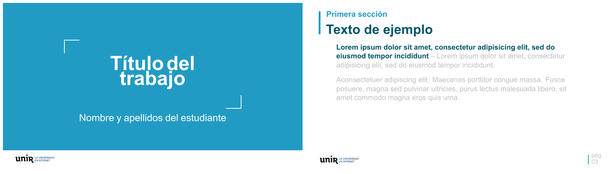

# Tema Beamer UNIR

Tema de Beamer para las diapositivas de defensa de TFX en la UNIR. Este tema es una "traducción" a $\LaTeX{}$ del PowerPoint proporcionado por la UNIR en el Máster en Visual Analytics y Big Data, por lo que se han implementado los elementos básicos que aparecen en este. Cabecera y pie de página con la identidad corporativa, portada, diapositiva de índice a pantalla completa y estilos de listas. 



## Requisitos

- Una distribución de $\LaTeX{}$ (TeX Live, MiKTeX...) con `latexmk`.
- Compilación con XeLaTeX (el tema usa `fontspec` para la tipografía, no compila con `pdflatex`).

## Uso

1. Clona o descarga este repositorio.
2. Edita [main.tex](main.tex) con tu contenido.
3. Compila:

   ```bash
   latexmk -xelatex main.tex
   ```

   O manualmente, ejecutando XeLaTeX dos veces (necesario para que el índice y las referencias de sección se resuelvan bien):

   ```bash
   xelatex main.tex
   xelatex main.tex
   ```

## Estructura mínima de un documento

```latex
\documentclass[aspectratio=169,t]{beamer}
\usetheme{unir}

\title{Título del trabajo}
\author{Nombre y apellidos del estudiante}

\begin{document}

  \maketitle
  \tableofcontents

  \section{Primera sección}
    \subsection{Primera subsección}

      \begin{frame}
        Contenido de la diapositiva.
      \end{frame}

\end{document}
```

- La cabecera con el título de sección/subsección solo aparece a partir de que se declara al menos un `\section{...}` (por eso no se ve en la portada ni antes de la primera sección).
- `\tableofcontents` está redefinido para generar una diapositiva de índice a pantalla completa en lugar del listado estándar de Beamer.

## Archivos del repositorio

| Archivo | Descripción |
|---|---|
| [beamerthemeunir.sty](beamerthemeunir.sty) | Definición del tema: colores, tipografía, portada, cabecera, pie de página e índice. |
| [main.tex](main.tex) | Documento de ejemplo con secciones, listas y texto de muestra. |
| `logo.png` | Logotipo mostrado en portada y pie de página. |
| `main.pdf` | Resultado compilado de ejemplo. |

## Contribuciones

Se aceptan PRs para mejorar todo lo posible la plantilla.

## Licencia

Distribuido bajo licencia [MIT](LICENSE).
